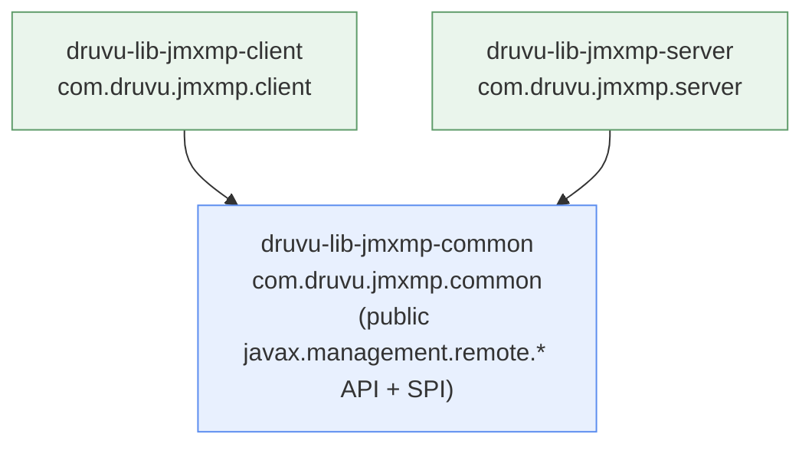

# druvu-lib-jmxmp

A modular, security-hardened **JMXMP** client/server library — the JSR-160
"optional" connector (JMX over a plain socket, no RMI), re-modularized for the
Java Platform Module System and locked to a single mandatory transport
security profile.

It is a maintained fork of the OpenDMK `jmx-optional` reference
implementation. The public OpenDMK API under `javax.management.remote.*` is
**FQN-frozen** — existing code that talks to `JMXMPConnector` /
`JMXMPConnectorServer` via `JMXConnectorFactory` recompiles unchanged.

> **Status: pre-release.** Not yet published to Maven Central. Build from
> source (see below). The wire/security model below is a deliberate,
> documented break from upstream OpenDMK — read [Security](#security-mandatory)
> before adopting.

## Why this fork

- **JPMS-modular on Java 21.** Three real modules with a strict
  `client → common`, `server → common` dependency direction — no
  split packages, no automatic-module guesswork.
- **Security is mandatory on the server, secure-by-default on the client.**
  The server is exactly `TLS SASL/PLAIN` with a required `JMXAuthenticator` —
  no plaintext, no other SASL mechanisms, no escape hatch. The client enforces
  the same set by default, with a typed, **code-only** opt-out
  (`ClientProfilePolicy`) for reaching legacy/plaintext endpoints — never
  settable via a system property or the command line.
- **Drop-in API.** `javax.management.remote.{jmxmp,generic,message}` is
  byte-for-byte the OpenDMK public surface (verified each build against a
  1.5.0 snapshot).

## Modern Java security (and a fixed auth-bypass)

**This fork fixes a silent authorization bypass that affects OpenDMK and every
known republication on current Java.** OpenDMK's bundled file access controller
reads the caller identity with `Subject.getSubject(AccessController.getContext())`
and treats a `null` subject as *"security is not enabled — allow every
operation"*. The Security Manager has been disabled by default since JDK 18 and
**removed permanently** by JEP 486 (JDK 24), so on JDK 24/25 that read is
*always* `null` — meaning **OpenDMK and its republications silently authorize
every operation** the moment they run on a current JDK. This fork reads identity
via `Subject.current()` and **fails closed**: no authenticated subject ⇒ access
denied, never allow-all. It is pinned by a permanent regression test that runs
on **JDK 21 *and* 25**.

Beyond that one fix, the model is built for the post-Security-Manager platform:

- **Works on current Java.** OpenDMK and the four republications depend on the
  Security Manager (removed by JEP 486); they are effectively broken on JDK 25.
  This fork targets **JDK 21–25+**.
- **No deprecated machinery.** No `SecurityManager`, no
  `AccessController`/`doPrivileged`, no `--enable-…` flags, no
  deprecation-for-removal warnings. Identity propagates through the JDK's own
  sanctioned `Subject.current()` / `Subject.callAs`.
- **A real authorization model, in code.** A typed, **default-deny**
  `JmxmpAccessControl` SPI with a built-in role / `ObjectName`-pattern policy
  (`JmxmpAccessControl.policy()`) restores the per-operation control the removed
  `MBeanPermission` system used to give, and replaces OpenDMK's 2007
  `username=readonly|readwrite` properties file. The open-server opt-out
  (`JmxmpAccessControl.allowAll()`) is a typed, code-only sentinel — it can
  never be flipped by a system property, a config file, or the command line.
- **Honest, bounded compatibility.** The wire/transport API stays byte-for-byte
  OpenDMK (verified every build). The security-idiom change is the JDK forcing
  every library's hand — not this fork breaking faith.

See [`SECURITY.md`](SECURITY.md) for the threat model and the maintainer
support scope.

## Module layout



| Module | Artifact | Use when |
|---|---|---|
| common | `druvu-lib-jmxmp-common` | always (transitively pulled by the others) |
| client | `druvu-lib-jmxmp-client` | you connect *to* a JMXMP server |
| server | `druvu-lib-jmxmp-server` | you expose an MBean server over JMXMP |

`common` carries the public API + SPI; the client and server engines are
discovered at runtime via `ServiceLoader`. `common` has **zero** edge —
compile or reflective — to client/server, so a client-only or server-only
deployment resolves with only its own module + `common` on the path.

## Adding the dependency

Until a Maven Central release, build and install locally:

```bash
git clone https://github.com/DenissLarka/druvu-lib-jmxmp
cd druvu-lib-jmxmp
mvn -DskipTests install      # requires JDK 21
```

Then depend on the scenario you need (`groupId` `com.druvu`, version
`1.5.0-SNAPSHOT` until the `2.0.0` release):

**Client only**

```xml
<dependency>
    <groupId>com.druvu</groupId>
    <artifactId>druvu-lib-jmxmp-client</artifactId>
    <version>1.5.0-SNAPSHOT</version>
</dependency>
```

**Server only**

```xml
<dependency>
    <groupId>com.druvu</groupId>
    <artifactId>druvu-lib-jmxmp-server</artifactId>
    <version>1.5.0-SNAPSHOT</version>
</dependency>
```

**Both sides** (in-process loopback, tooling that does client *and* server) —
declare both `-client` and `-server`; each transitively brings `-common`.

## Security

By default this build accepts **exactly one** profile set:
`jmx.remote.profiles = "TLS SASL/PLAIN"`. Anything else fails fast:

- no `jmx.remote.profiles` → `IllegalArgumentException` at construction
- plaintext, TLS-only, SASL-only, or any non-PLAIN SASL mechanism
  (CRAM-MD5, DIGEST-MD5, GSSAPI, EXTERNAL, OAUTHBEARER) → `SecurityException`
- a server without a `JMXAuthenticator` → rejected at construction

On the **server** this is absolute — there is no escape hatch. On the
**client** it is the secure *default*: a typed, code-only `ClientProfilePolicy`
(below) lets an operator deliberately connect to legacy/plaintext endpoints.
With the default in force this is **wire-incompatible** with legacy plaintext
OpenDMK peers and with peers using any other SASL mechanism. That is
intentional.

### Configuration

Server:

```java
Map<String, Object> env = new HashMap<>();
env.put("jmx.remote.profiles", "TLS SASL/PLAIN");
env.put("jmx.remote.tls.socket.factory", sslContext.getSocketFactory());
env.put(JMXConnectorServer.AUTHENTICATOR, myAuthenticator); // required

JMXServiceURL url = new JMXServiceURL("jmxmp", "0.0.0.0", 5555);
JMXConnectorServer s = JMXConnectorServerFactory.newJMXConnectorServer(url, env, mbeanServer);
s.start();
```

Client:

```java
Map<String, Object> env = new HashMap<>();
env.put("jmx.remote.profiles", "TLS SASL/PLAIN");
env.put("jmx.remote.tls.socket.factory", sslContext.getSocketFactory());
env.put(JMXConnector.CREDENTIALS, new String[] {"alice", "s3cr3t"});

try (JMXConnector c = JMXConnectorFactory.connect(new JMXServiceURL("jmxmp", host, 5555), env)) {
    c.getMBeanServerConnection().getAttribute(name, "Message");
}
```

The `JMXAuthenticator` receives `String[]{user, password}` from each
SASL/PLAIN handshake and returns a `Subject` or throws `SecurityException`.

**TLS 1.3 by default.** When `jmx.remote.tls.enabled.protocols` is unset, both
the client and the server enable **only `TLSv1.3`** — not the JDK default
(which still permits TLS 1.2). To talk to a peer that cannot do 1.3, set the
key explicitly on **both** ends, e.g.:

```java
env.put("jmx.remote.tls.enabled.protocols", "TLSv1.3 TLSv1.2");
```

An explicit value overrides the default verbatim; this is the only way to
re-enable TLS 1.2 or older.

### Server security builder — `JmxmpServerSecurity` (recommended)

The raw env map above works, but it is easy to ship a server that is missing
TLS or the authenticator and only find out at connect time.
`JmxmpServerSecurity` is a small, **pure-assembler** facade that produces the
exact same env map — with the mandatory pieces enforced at **build time**, not
as a runtime surprise. It is the server-side counterpart to the client's
`ClientProfilePolicy`, and it is not a new connector API: you still call the
unchanged `JMXMPConnectorServer` constructor with the map it returns, so the
frozen `javax.management.remote.*` surface is untouched.

**Hardened, authenticated server (no authorization → authenticated-but-unrestricted):**

```java
import com.druvu.jmxmp.shared.JmxmpServerSecurity;

Map<String, Object> env = JmxmpServerSecurity.builder()
        .tls(sslContext)                 // REQUIRED
        .authenticator(myAuthenticator)  // REQUIRED
        .build();                        // IllegalStateException if either is missing

var url = new JMXServiceURL("jmxmp", "0.0.0.0", 5555);
var server = JMXConnectorServerFactory.newJMXConnectorServer(url, env, mbeanServer);
server.start();
```

**Hardened server + role-based authorization** (the part most deployments want
— authentication says *who*, this says *what they may do*):

```java
import com.druvu.jmxmp.shared.JmxmpAccessControl;
import static com.druvu.jmxmp.shared.JmxAction.*;

JmxmpAccessControl policy = JmxmpAccessControl.policy()
        .role("ro")
            .allow(GET_ATTRIBUTE, "*")
            .allow(GET_MBEAN_INFO, "*")
            .allow(QUERY).allow(GET_DOMAINS)
        .role("ops")
            .inherit("ro")
            .allow(INVOKE,        "com.acme:type=Cache,*")
            .allow(SET_ATTRIBUTE, "com.acme:type=Cache,*")
        .principal("svc-dashboard").grantedRoles("ro")
        .principal("alice").grantedRoles("ops")
        .build();   // fails fast: unknown/cyclic role, bad pattern, mis-ordered calls

Map<String, Object> env = JmxmpServerSecurity.builder()
        .tls(sslContext)
        .authenticator(myAuthenticator)
        .authorization(policy)           // strict default-deny once supplied
        .build();
```

With a control supplied the server is **default-deny**: anything not
explicitly granted is refused with a `SecurityException` before the call ever
reaches the MBean. `svc-dashboard` can read and query; `alice` can also invoke
and set on the cache MBeans; neither can do anything else.

**Deliberately open (authentication only)** — the *only* route to an
unrestricted server is an explicit, code-only sentinel; there is no config
flag for it:

```java
.authorization(JmxmpAccessControl.allowAll())   // typed, code-only — never a property
```

**Advanced JSR-160 keys** go through `rawEnv` (last-wins). It is an escape
hatch, not a back door: it **cannot set or unset a mandatory/typed key**
(`jmx.remote.profiles`, the TLS factory, the authenticator, or the
authorization key) — that fails at `build()`:

```java
.rawEnv("jmx.remote.x.notification.buffer.size", 2000)
```

Guarantees, by construction: `build()` throws `IllegalStateException` if TLS
or the authenticator is absent; a non-`JmxmpAccessControl` value can never
reach the authorization slot (so the open-server opt-out cannot be flipped by
ops tooling); and the returned map is a fresh, caller-owned `HashMap`.

### Client profile policy (connecting to legacy / plaintext endpoints)

A JMX **client** often has to reach existing endpoints it does not control —
including plaintext or TLS-only ones. The server is unconditionally locked to
`TLS SASL/PLAIN`, but the client default is relaxable through a typed,
**code-only** opt-out: `ClientProfilePolicy`, supplied under
`ClientProfilePolicy.ENV_KEY`. Only a real `ClientProfilePolicy` instance
relaxes it — a string under that key (e.g. from a `-D` property) is rejected,
so the opt-out can never be flipped by ops tooling or the command line.

```java
import com.druvu.jmxmp.shared.ClientProfilePolicy;

// 1. Default — supply nothing. Client requires exactly TLS SASL/PLAIN.
Map<String, Object> env = new HashMap<>();
env.put("jmx.remote.profiles", "TLS SASL/PLAIN");
env.put("jmx.remote.tls.socket.factory", sslContext.getSocketFactory());
env.put(JMXConnector.CREDENTIALS, new String[] {"alice", "s3cr3t"});

// 2. Plaintext / anything — no client-side profile enforcement at all.
Map<String, Object> env = new HashMap<>();
env.put(ClientProfilePolicy.ENV_KEY, ClientProfilePolicy.unrestricted());
// no jmx.remote.profiles needed → connects to a plaintext JMXMP endpoint
JMXConnectorFactory.connect(new JMXServiceURL("jmxmp", host, 5555), env);

// 3. TLS-only (no SASL) — pin an exact alternate set.
Map<String, Object> env = new HashMap<>();
env.put(ClientProfilePolicy.ENV_KEY, ClientProfilePolicy.require("TLS"));
env.put("jmx.remote.profiles", "TLS");
env.put("jmx.remote.tls.socket.factory", sslContext.getSocketFactory());

// 4. A custom set, e.g. TLS + an alternate SASL mechanism the peer requires.
env.put(ClientProfilePolicy.ENV_KEY,
        ClientProfilePolicy.require("TLS", "SASL/DIGEST-MD5"));
env.put("jmx.remote.profiles", "TLS SASL/DIGEST-MD5");
```

`unrestricted()` accepts any profile set including none; `require(...)` accepts
**exactly** the enumerated set (order-independent, case-insensitive) and pairs
with a matching `jmx.remote.profiles`. This relaxes only the transport
negotiation — the default-deny serialization allow-list still guards the
client receive path regardless of profile. It has **no effect on the server**.

For a deliberately unauthenticated deployment, use the shipped
`AllowAnyAuthenticator` — which itself refuses to construct unless you
explicitly acknowledge it:

```java
env.put("com.druvu.jmxmp.security.acknowledge.allow.any",
        "YES_I_ACCEPT_NO_AUTHENTICATION");
env.put(JMXConnectorServer.AUTHENTICATOR, new AllowAnyAuthenticator(env));
```

### Hardening: bearer token as password

The `JMXAuthenticator` SPI is mechanism-agnostic. An implementation is free
to treat the `password` slot as a short-lived **OAuth/JWT bearer token**, an
HMAC ticket, or any other validated one-time string rather than a reusable
secret:

```java
public Subject authenticate(Object credentials) {
    String[] c = (String[]) credentials;        // {user, token}
    Principal p = tokenVerifier.verify(c[1]);    // reject if expired/forged
    return new Subject(true, Set.of(p), Set.of(), Set.of());
}
```

This gives most of SCRAM's properties — no reusable secret on internal
network hops past the TLS terminator — without adding a SASL mechanism to the
library. The wire stays plain SASL/PLAIN inside the mandatory TLS tunnel.

### Serialization allow-list (fails closed)

JMXMP deserializes Java objects off the wire. This library installs a
**built-in, default-deny `ObjectInputFilter`** on every wire stream (the
protocol-message stream from the first handshake byte, and the MBean payload
stream). It permits the JMX model + safe JDK value types and **rejects
everything else** — the well-known deserialization gadget sinks never resolve.

Consequence you *will* hit: an MBean that exchanges your own application
classes fails closed until you allow-list their packages
(`;`-separated prefixes; a trailing prefix matches subpackages):

```
-Dcom.druvu.jmxmp.serial.allow=com.acme.metrics.;com.acme.dto.
```

Keep prefixes narrow. The built-in filter is *merged with* any process-wide
`-Djdk.serialFilter=...` you set — a reject from either wins, so a stricter
JVM filter can only tighten it, never loosen it. See
[`SECURITY.md`](SECURITY.md) for the full model.

## Compatibility & breaking changes vs OpenDMK

- Public `javax.management.remote.*` API: **unchanged** (frozen, verified).
- Internal `com.sun.jmx.remote.*` packages renamed to `com.druvu.jmxmp.*` —
  only consumers of *internal* classes must update imports.
- Security is mandatory and single-shape on the server, secure-by-default on
  the client (above) — the one behavioral break for public-API users; set
  `jmx.remote.profiles` accordingly, or use a code-only `ClientProfilePolicy`
  on the client to reach legacy/plaintext endpoints. The server has no opt-out.
- **Server-side caller identity is now `Subject.current()`**, not the
  Security-Manager-era `Subject.getSubject(AccessController.getContext())`.
  MBeans (or `JMXAuthenticator`s) that inspect the caller must use
  `Subject.current()`; the old idiom returns `null` on JDK 24+ regardless of
  this library. This is the platform's change (JEP 411/486), surfaced honestly
  rather than papered over — see *Modern Java security* above.
- **Authorization replaced, no shim.** OpenDMK's `MBeanServerFileAccessController`
  and the `jmx.remote.x.access.file` properties mechanism are **removed**.
  Authorization is now the typed, code-only `JmxmpAccessControl` SPI
  (default-deny) with a built-in `JmxmpAccessControl.policy()` RBAC, supplied
  under `JmxmpAccessControl.ENV_KEY` (or via the `JmxmpServerSecurity` builder).
  No control configured ⇒ authenticated-but-unrestricted (authentication is
  still mandatory); a non-`JmxmpAccessControl` value under the key ⇒
  fail-closed at server start. Migration: express each legacy
  `user=readonly|readwrite` line as `policy().role(...).principal(user)
  .grantedRoles(...)` in code.
- **Subject delegation removed.** This library does not support JMX subject
  delegation. The frozen `javax.management.remote.*` delegation signatures
  remain (drop-in compatibility), but a request carrying a delegation subject
  is **rejected fail-closed** (`SecurityException`) — never silently run as the
  authenticated user.
- TLS now defaults to **`TLSv1.3` only** (OpenDMK inherited the JDK default,
  which still permits TLS 1.2). Set `jmx.remote.tls.enabled.protocols` on both
  ends to talk to a non-1.3 peer.
- `GenericConnector` / `GenericConnectorServer` load their engine lazily via
  `ServiceLoader`; subclassers relying on engine fields existing in the
  constructor body must adjust.
- Pre-Java-1.4 JRE / reflection compatibility shims removed. Baseline is
  **Java 21**.

## Build

```bash
mvn clean verify        # JDK 21; runs the classpath + module-path test matrix
```

The build enforces formatting (`spotless`), the public-API snapshot diff, and
a JPMS module-path validation matrix (client-only / server-only / both-sides
deployment shapes).

## License

Derived from OpenDMK `jmx-optional` (Sun Microsystems). Dual-licensed: GPL v2
**with the Classpath exception**, or CDDL v1.0 — your choice. See
[`LICENSE`](LICENSE). Original copyright notices are preserved verbatim in
every source file.
